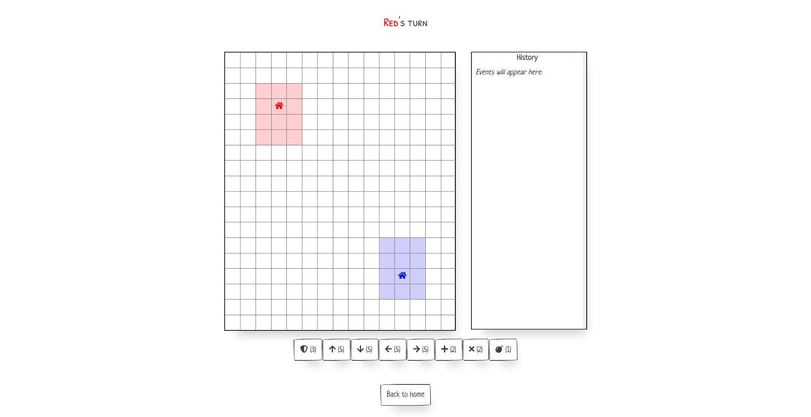

    

    <h4>A 2-player strategy game inspired by Conundrum.</h4>

    
    
    

     
    <a href="#about">About</a> •
    <a href="#development">Development</a> •
    <a href="#credits">Credits</a> •
    <a href="#license">License</a>

## About

Thinktank is a 2-player strategy game inspired by Conundrum.

Learn the rules & play online at [thinktank.crespi.dev](https://thinktank.crespi.dev)

## Development

See [DEVELOPERS.md](DEVELOPERS.md) for information about building, testing, and running the game.

## Credits

- Project inspired by Conundrum by [Mundy Games](https://mundygames.wixsite.com/website-4)
- Font Awesome icons used under the [Font Awesome Free License](https://github.com/FortAwesome/Font-Awesome/blob/master/LICENSE.txt)
- React, PaperCSS, and other libraries used under their respective licenses

## License

[MIT](https://choosealicense.com/licenses/mit/)